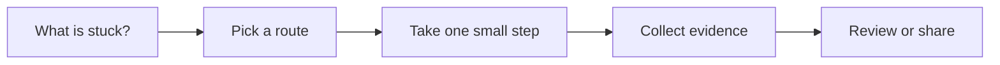

# Automated Verification

[English](README.md) | [简体中文](README.zh-CN.md)

Use this when AI changed code and you need repeatable evidence that it still works.

## The situation

This scenario turns confidence into evidence. AI-assisted coding increases the amount of change a team can produce, so verification has to become cheaper and more repeatable. The point is not to automate everything. The point is to protect the behaviors that would hurt if they silently broke.

Verification should be chosen by behavior and risk, not by tool popularity. A unit test, API regression test, browser E2E flow, mobile scenario, CI gate, or AI application eval can all be correct in different branches of this scenario.

## What you should have afterward

- A clear behavior under protection.
- A test or check at the cheapest reliable layer.
- Evidence that can be attached to a PR or release decision.

## Start here when

- AI-generated changes need proof before merge.
- A critical path is repeatedly changed by humans or agents.
- Manual QA is slow, inconsistent, or easy to forget.
- A bug should become a regression test.
- An AI product feature needs evaluation beyond a single demo prompt.

## Start somewhere else when

- Nobody agrees on expected behavior. Start with Requirements to Tasks.
- The system cannot be run or observed. Start by making it observable or scriptable.
- A one-off prototype is cheaper to throw away than to automate.
- The check would be more brittle than the behavior it protects.

## How to choose a route

A quick way to read this page:




- If logic is pure or close to pure, prefer unit tests.
- If behavior crosses service boundaries, use integration or contract tests.
- If the user flow matters, use E2E or scripted browser/mobile verification.
- If the API is the product boundary, use API regression collections or contract checks.
- If an AI system produces variable outputs, use evals, golden datasets, traces, and review samples.
- If the check must block unsafe changes, run it in CI with clear failure output.

## Common routes

### Unit and component tests

Use this when: business rules, parsing, permission checks, UI components, and bug regression cases.

Skip it when: mocking so much that the test no longer resembles real behavior.

Tools that often show up: Jest, Vitest, pytest, JUnit, XCTest, React Testing Library, Flutter widget tests.

### Web UI E2E

Use this when: critical browser flows such as signup, checkout, invite, settings, and admin actions.

Skip it when: testing every visual detail through E2E. Keep E2E for flows, not every component state.

Tools that often show up: Playwright, Cypress, Selenium, Storybook interaction tests.

### Mobile E2E

Use this when: native app flows, onboarding, payments, permissions, and device-specific behavior.

Skip it when: starting with full-device tests when a widget or integration test would catch the risk.

Tools that often show up: Maestro, Detox, Appium, XCUITest, Espresso.

### API and contract regression

Use this when: backend services, public APIs, webhooks, auth behavior, and integrations.

Skip it when: collections that require fragile shared state or manual secrets.

Tools that often show up: Bruno, Postman, Pact, Schemathesis, OpenAPI validators, supertest.

### AI application evals

Use this when: RAG, agents, classifiers, extraction, moderation, and generated responses.

Skip it when: judging an AI feature with one golden prompt. Use datasets and failure review.

Tools that often show up: Braintrust, Langfuse, OpenAI Evals patterns, promptfoo, custom evaluation harnesses.

### CI quality gate

Use this when: checks that should block merge or release.

Skip it when: slow, flaky gates that train people to ignore failures.

Tools that often show up: GitHub Actions, GitLab CI, CircleCI, Buildkite, required status checks.

## Walk through it

1. Name the behavior and why it matters.
2. Choose the cheapest layer that can detect the failure with enough confidence.
3. Make the check fail once, or at least confirm it would have caught the bug.
4. Keep setup deterministic: data, auth, environment, and secrets.
5. Run the check locally or in CI before asking for review.
6. Attach evidence: logs, traces, screenshots, video, test output, or eval summary.
7. Revisit flaky or slow checks quickly. A noisy gate loses authority.

## Example

```md
Behavior:
Workspace admins can invite one teammate and duplicate invites show an error.

Layer:
Playwright browser smoke test because the risk crosses UI, API, auth, and persistence.

Test outline:
1. Login as workspace admin.
2. Open members settings.
3. Submit a valid email.
4. Assert pending invite appears.
5. Submit the same email again.
6. Assert duplicate invite error appears.

Evidence:
CI test output plus Playwright trace on failure.
```

## Check yourself

- Does the check protect a named behavior?
- Is this the cheapest reliable layer?
- Would the check fail for the bug or regression you care about?
- Can someone run it without tribal knowledge?
- Is the failure output useful enough for a reviewer or on-call engineer?

## Where people get burned

- Writing broad E2E tests because they feel realistic, then drowning in flake.
- Adding snapshots that approve accidental output.
- Testing implementation details while the user-visible behavior remains unprotected.
- Keeping tests local and never wiring them into CI or PR evidence.
- Using AI eval scores without reviewing failure examples.

## When a team adopts it

Teams should maintain a verification ladder: unit, integration, API, UI, mobile, eval, and CI gate. The ladder helps reviewers ask why a check lives at a certain layer.

For AI-assisted coding, ask every PR to state which checks were run and why those checks are enough for the risk. That sentence often matters as much as the test itself.

## Related scenarios

- [Requirements to Tasks](../requirements-to-tasks/README.md)
- [Code Review and Quality Gates](../code-review-quality-gates/README.md)
- [Release and Change Management](../release-change-management/README.md)
