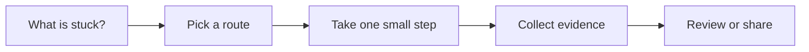

# Code Review and Quality Gates

[English](README.md) | [简体中文](README.zh-CN.md)

Use this when AI-assisted work needs review before it becomes maintenance debt.

## The situation

This scenario protects the merge boundary. AI can produce plausible code quickly, so review has to check intent, scope, risk, and evidence before style. Quality gates automate the checks that should not depend on reviewer memory.

The goal is not to slow every PR with ceremony. The goal is to make the risky parts visible: unexpected scope, missing tests, permission changes, new dependencies, generated code, data migrations, and security-sensitive behavior.

## What you should have afterward

- A review order that starts with task match and risk.
- A set of automated gates that catch repeatable problems.
- A PR standard for AI-assisted work: intent, diff, evidence, known limits.

## Start here when

- AI-generated or AI-assisted work is ready for review.
- The diff is larger than a human can trust at a glance.
- The team keeps catching the same issue late.
- You need branch protection, required checks, or security scanning.
- Reviewers need a clearer standard for what evidence belongs in a PR.

## Start somewhere else when

- The task itself is unclear. Start with Requirements to Tasks.
- The code does not run. Start with Automated Verification.
- The team is using gates to avoid making ownership decisions.
- A gate is noisy enough that people routinely bypass it.

## How to choose a route

A quick way to read this page:




- If the risk is subjective or architectural, use human review with explicit questions.
- If the risk is repeatable, automate it with lint, typecheck, tests, or security scanning.
- If the risk is ownership, use CODEOWNERS or required review rules.
- If the risk is runtime behavior, require verification evidence in the PR.
- If the risk is generated code volume, require smaller PRs or a generated-code note.

## Common routes

### Human review checklist

Use this when: behavior, scope, architecture, readability, product fit, and risk judgment.

Skip it when: reviewing style first while missing task drift or missing evidence.

Tools that often show up: GitHub/GitLab PR reviews, review templates, CODEOWNERS, pair review.

### Static and semantic checks

Use this when: repeatable code quality, type, formatting, security, and dependency issues.

Skip it when: adding tools without deciding which failures block merge.

Tools that often show up: ESLint, TypeScript, Ruff, go vet, CodeQL, Semgrep, SonarQube, Dependabot, Renovate.

### Test and build gates

Use this when: behavior that can be checked automatically before merge.

Skip it when: slow flaky pipelines that hide real signal.

Tools that often show up: GitHub Actions, GitLab CI, Buildkite, CircleCI, required status checks.

### AI-assisted review

Use this when: summarizing large diffs, pointing out risk areas, and checking PR against the task brief.

Skip it when: treating AI review as approval. It is another reviewer signal, not ownership.

Tools that often show up: code review assistants, repo-aware chat, custom review prompts, CI comments.

## Walk through it

1. Read the task brief before the diff.
2. Check whether the diff matches the task and respects non-goals.
3. Scan for risky areas: auth, permissions, billing, data, migrations, external writes, secrets.
4. Check automated evidence: tests, typecheck, lint, CI, security scan, manual smoke notes.
5. Review the code for maintainability and local conventions.
6. Ask for smaller PRs when the diff mixes unrelated goals.
7. Turn repeated review comments into automated gates or templates.

## Example

```md
AI-assisted PR review order:

1. Task match
- Does the diff implement the accepted task?
- Are non-goals respected?

2. Risk
- Auth, permissions, billing, data, migrations, or external writes touched?
- New dependency or generated code added?

3. Evidence
- Tests run?
- Manual path checked?
- CI linked?

4. Maintainability
- Follows local patterns?
- Names and boundaries make sense?
- No unrelated cleanup?
```

## Check yourself

- Did the reviewer read the task before reviewing the diff?
- Are risky areas explicitly called out?
- Do required checks match the risk of the change?
- Is there evidence for behavior, not only passing lint?
- Can recurring review feedback become an automated gate?

## Where people get burned

- Reviewers skim generated code and trust the assistant summary.
- PRs include unrelated cleanup that hides the actual behavior change.
- Gates check formatting but miss permissions, migrations, or data loss risk.
- Security tools are added but nobody owns triage.
- AI review comments are treated as a substitute for human ownership.

## When a team adopts it

Team practice should define a PR evidence standard. For AI-assisted PRs, require task intent, verification, and known limitations. For high-risk areas, require owner review and stronger tests.

Keep gates boring and trusted. A gate that fails too often for bad reasons becomes background noise.

## Related scenarios

- [Requirements to Tasks](../requirements-to-tasks/README.md)
- [Automated Verification](../automated-verification/README.md)
- [Team AI Governance](../team-ai-governance/README.md)
