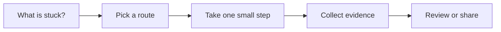

# Coding and Refactoring

[English](README.md) | [简体中文](README.zh-CN.md)

Use this when AI can help write or move code, but the change still needs human control.

## The situation

This scenario covers implementation, migration, cleanup, and refactoring with AI in the loop. The goal is not to let AI write as much code as possible. The goal is to keep the change understandable, reviewable, and backed by evidence.

AI is strongest when the task is bounded, the project context is visible, and verification is close. It is weakest when the request mixes product decisions, architecture redesign, and broad code edits in one prompt.

## What you should have afterward

- A bounded implementation plan before edits start.
- Small checkpoints that can be reviewed and tested.
- A final diff that matches the task instead of drifting into opportunistic cleanup.

## Start here when

- You need AI help implementing a clear task.
- A refactor has a defined behavioral boundary.
- A migration can be split into repeatable mechanical steps.
- You want faster code search, edit planning, or test generation.
- You can run meaningful tests or checks during the work.

## Start somewhere else when

- The task is vague. Start with Requirements to Tasks.
- The assistant does not understand the repo conventions. Start with Project Context Memory.
- The change touches security, money, data loss, or migrations without a rollback plan.
- You cannot run or inspect the system at all. Start by creating a verification path.

## How to choose a route

A quick way to read this page:




- If the work is local and low risk, use AI for edit planning and small patches.
- If the work is repetitive, prefer codemods, typed refactors, or compiler-backed changes.
- If the work changes behavior, pair AI edits with tests or manual smoke checks.
- If the work touches architecture, ask for options and tradeoffs before code.
- If the diff grows beyond review, stop and split the task.

## Common routes

### Pair-programming assistant

Use this when: bounded edits, code search, small bug fixes, and test drafting.

Skip it when: large autonomous rewrites without checkpoints.

Tools that often show up: IDE assistants, chat assistants with repo context, terminal coding agents.

### Agentic implementation loop

Use this when: tasks that need multi-file edits plus command-line verification.

Skip it when: production-affecting commands, secret handling, or external writes without approval.

Tools that often show up: coding agents, local sandboxes, branch-based workflows, CI feedback.

### Codemod or compiler-backed migration

Use this when: renames, API migrations, framework upgrades, and repeated patterns.

Skip it when: semantic changes where a syntactic transform cannot capture intent.

Tools that often show up: jscodeshift, ts-morph, OpenRewrite, Rector, gofmt/go vet, language server refactors.

### Test-first or characterization-first refactor

Use this when: legacy areas where behavior must not change.

Skip it when: writing brittle snapshot tests that freeze accidental behavior.

Tools that often show up: unit tests, integration tests, golden tests, approval tests, Playwright/Cypress for UI smoke.

## Walk through it

1. Start with a task brief and name the intended behavior boundary.
2. Ask AI for a plan that names files, risk areas, and verification.
3. Approve the plan or narrow it before edits start.
4. Edit in checkpoints. Each checkpoint should be understandable on its own.
5. Run the cheapest relevant check after each meaningful step.
6. Review the diff against the original task, not against what the assistant decided to do.
7. Write a PR summary that includes verification and known limits.

## Example

```md
Task:
Move notification preference logic from SettingsPage into a reusable hook.

Behavior boundary:
No UI behavior, API shape, or persistence behavior should change.

Plan:
1. Find current state and API calls.
2. Extract useNotificationPreferences.
3. Update SettingsPage to call the hook.
4. Run notification tests and typecheck.
5. Smoke test the settings page.

Stop if:
The refactor requires API changes or changes loading/error behavior.
```

## Check yourself

- Is the task small enough to review in one PR?
- Did the assistant name likely files and risk areas before editing?
- Does each checkpoint keep the system runnable?
- Were tests, typechecks, lint, or smoke checks run?
- Does the final diff avoid unrelated cleanup?

## Where people get burned

- The assistant does broad cleanup because the task lacked non-goals.
- A refactor quietly changes behavior and tests only cover happy paths.
- The diff is too large for meaningful review.
- The agent adds new dependencies instead of using local helpers.
- A mechanical migration is done by freehand edits instead of a repeatable transform.

## When a team adopts it

Team practice should define which AI edits are allowed without extra review and which areas require human approval. Auth, billing, migrations, data deletion, and external integrations usually deserve stronger review.

For repeated migrations, capture the prompt, codemod, command sequence, and verification evidence. The second migration should be cheaper and safer than the first.

## Related scenarios

- [Requirements to Tasks](../requirements-to-tasks/README.md)
- [Automated Verification](../automated-verification/README.md)
- [Code Review and Quality Gates](../code-review-quality-gates/README.md)
