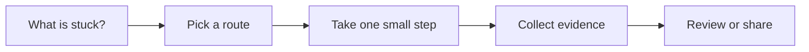

# Debugging

[English](README.md) | [简体中文](README.zh-CN.md)

Use this when you have symptoms, but not a proven cause.

## The situation

This scenario helps move from symptom to cause before code changes. AI is useful for summarizing logs, generating hypotheses, reading unfamiliar code paths, and proposing experiments. It is dangerous when it turns a plausible story into a confident fix without evidence.

Good debugging is evidence-shaped. A useful AI interaction should produce a hypothesis that predicts the next observation, not a patch that merely sounds reasonable.

## What you should have afterward

- A short debugging note with symptom, evidence, hypotheses, experiments, and result.
- A minimal reproduction or targeted check when possible.
- A fix connected to evidence, plus a regression check.

## Start here when

- You see an error, alert, flaky test, or user report but do not know the cause.
- Logs, traces, stack traces, or metrics need to be connected.
- A bug appears only in some environments or data states.
- You need help reading an unfamiliar code path.
- A previous fix did not hold and you need a stronger causal chain.

## Start somewhere else when

- The system is actively burning and coordination matters more than root cause. Start with Incident Response.
- The expected behavior is unclear. Start with Requirements to Tasks.
- You already have a fix and need confidence. Start with Automated Verification.
- The data includes secrets or customer information that should not be pasted into an AI tool.

## How to choose a route

A quick way to read this page:




- If you can reproduce locally, write the reproduction first and then inspect code.
- If you cannot reproduce, collect logs, traces, metrics, release history, and recent changes.
- If the bug is intermittent, look for timing, concurrency, cache, environment, and data-shape differences.
- If the symptom began after a release, compare commits and use git bisect or deploy history.
- If the bug affects customers now, coordinate through Incident Response while debugging continues.

## Common routes

### Reproduction-first debugging

Use this when: local bugs, deterministic failures, failing tests, and UI regressions.

Skip it when: spending hours on a perfect reproduction when production impact needs immediate mitigation.

Tools that often show up: unit tests, integration tests, Playwright traces, browser devtools, debugger, minimal repro repos.

### Observability-first debugging

Use this when: production-only failures, distributed systems, performance issues, and partial outages.

Skip it when: treating dashboard correlation as proof without checking timing and causality.

Tools that often show up: Sentry, Datadog, New Relic, Grafana, OpenTelemetry traces, structured logs.

### Change-history debugging

Use this when: regressions after deploys, dependency upgrades, or configuration changes.

Skip it when: assuming the newest change caused the bug without evidence.

Tools that often show up: git bisect, release notes, deploy logs, feature flag history, dependency lockfile diff.

### AI-assisted hypothesis generation

Use this when: large logs, unfamiliar code, many possible causes, or messy incident threads.

Skip it when: accepting the first plausible explanation. Ask for competing hypotheses and evidence needed.

Tools that often show up: chat assistants, log summarizers, codebase-aware assistants, notebook-style debugging notes.

## Walk through it

1. State the symptom in one sentence with time, environment, and affected user path.
2. Collect the strongest evidence: error message, stack trace, request, release, logs, trace, screenshot.
3. Separate observation from interpretation. Do not let AI blend them.
4. Write two or three hypotheses and what each would predict.
5. Run the smallest experiment that can disprove one hypothesis.
6. Fix only after the cause is tied to evidence.
7. Add a regression check so the bug does not return silently.

## Example

```md
Symptom:
Checkout returns 500 after a coupon is applied. Started after release 2026.07.05. Only EUR checkouts reported so far.

Evidence:
- Server log: currency_code is null when updating payment intent.
- Request includes coupon_id and currency=EUR.
- No failures for USD in the last hour.

Hypotheses:
1. Coupon recalculation drops currency_code for non-default currencies.
2. Payment provider rejects one coupon configuration.
3. A feature flag enabled the new checkout path for EU users.

Next experiment:
Trace applyCoupon to updatePaymentIntent with EUR and USD fixtures.

Regression check:
Add test for coupon plus non-default currency.
```

## Check yourself

- Is the symptom specific enough to reproduce or search for?
- Are observations separated from guesses?
- Does each hypothesis predict a checkable result?
- Did the fix target the proven cause instead of a nearby smell?
- Was a regression check added or updated?

## Where people get burned

- AI writes a confident fix based on one stack trace.
- The team changes several things at once and cannot tell what mattered.
- The bug is fixed locally but not in the environment where it failed.
- Logs with sensitive data are pasted into external tools.
- The fix removes the symptom but leaves the underlying invariant untested.

## When a team adopts it

A team debugging habit should preserve the trail: symptom, evidence, hypotheses, experiment, result, fix, regression check. This is especially useful when AI summarizes long threads because the summary must stay anchored to facts.

For recurring bug classes, turn the debugging note into a test, runbook, or code comment near the invariant.

## Related scenarios

- [Incident Response](../incident-response/README.md)
- [Automated Verification](../automated-verification/README.md)
- [Documentation and Knowledge](../documentation-knowledge/README.md)
