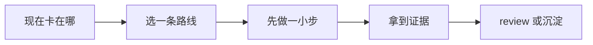

# 调试

[English](README.md) | 简体中文

当你已经看到故障现象，但还没有证明根因，就看这个场景。

## 你现在遇到的其实是什么

这个场景帮你先从现象走到原因，再改代码。AI 很适合总结日志、生成假设、读陌生代码路径、提出实验。危险在于，它也很容易把一个听起来合理的故事包装成确定修复。

好的调试是被证据牵引的。一次有用的 AI 交互应该产出一个能预测下一个观察结果的假设，而不是直接给一个听上去顺的 patch。

## 做完以后应该留下什么

- 一份短调试笔记：现象、证据、假设、实验和结果。
- 尽可能有一个最小复现或目标明确的检查。
- 修复和证据连在一起，并补上回归检查。

## 什么时候从这里开始

- 你看到 error、alert、flaky test 或用户反馈，但不知道原因。
- 日志、trace、stack trace 或 metrics 需要串起来。
- bug 只在某些环境或数据状态下出现。
- 你需要读一条陌生代码路径。
- 之前的修复没有站住，需要更强的因果链。

## 什么时候先别看这一页

- 系统正在出生产事故，协调比根因更紧急。先看事故响应。
- 预期行为本身不清楚。先看需求到任务。
- 你已经有修复，现在需要信心。先看自动化验证。
- 数据里包含不该贴进 AI 工具的 secrets 或客户信息。

## 怎么选路线

可以先按这条线读：




- 如果能本地复现，先写复现，再读代码。
- 如果不能复现，先收集日志、trace、metrics、发布历史和最近改动。
- 如果 bug 间歇出现，优先看 timing、并发、缓存、环境和数据形状差异。
- 如果现象出现在某次发布后，查 commit、deploy history，必要时用 git bisect。
- 如果当前影响客户，一边走事故响应，一边继续调试。

## 常见路线

### 先复现再调试

适合: 本地 bug、确定性失败、失败测试和 UI 回归。

不适合: 生产影响正在扩大时，花太久追求完美复现。

常见工具和做法: 单测、集成测试、Playwright traces、浏览器 devtools、debugger、最小复现 repo。

### 先看可观测性

适合: 只在生产出现的问题、分布式系统、性能问题和局部故障。

不适合: 把 dashboard 相关性当成证明，不检查时间线和因果。

常见工具和做法: Sentry、Datadog、New Relic、Grafana、OpenTelemetry traces、结构化日志。

### 沿变更历史排查

适合: 发布、依赖升级或配置变化之后出现的回归。

不适合: 没有证据就认定最近一次改动是原因。

常见工具和做法: git bisect、release notes、deploy logs、feature flag history、lockfile diff。

### AI 辅助生成假设

适合: 日志很长、代码陌生、可能原因很多，或事故聊天记录很乱。

不适合: 接受第一个听起来合理的解释。要求 AI 给竞争假设和需要的证据。

常见工具和做法: 聊天助手、log summarizer、带 codebase 上下文的 assistant、调试笔记。

## 跟着做一遍

1. 用一句话写清现象，带上时间、环境和受影响路径。
2. 收集最强证据：错误信息、stack trace、request、release、日志、trace、截图。
3. 把观察和解释分开，不要让 AI 混成一段。
4. 写两三个假设，并说明每个假设会预测什么结果。
5. 做能推翻某个假设的最小实验。
6. 只有当根因和证据连上以后再修。
7. 补回归检查，避免这个 bug 静悄悄回来。

## 示例

```md
现象:
用户使用 coupon 后 checkout 返回 500。2026.07.05 发布后开始出现，目前只看到 EUR checkout 反馈。

证据:
- Server log: 更新 payment intent 时 currency_code 是 null。
- Request 里有 coupon_id 和 currency=EUR。
- 最近一小时 USD 没有失败。

假设:
1. Coupon recalculation 在非默认币种下丢了 currency_code。
2. 支付服务拒绝某个 coupon 配置。
3. Feature flag 给 EU 用户打开了新 checkout path。

下一个实验:
用 EUR 和 USD fixture trace applyCoupon 到 updatePaymentIntent。

回归检查:
补一条 coupon + 非默认币种测试。
```

## 检查一下自己

- 现象是否具体到可以复现或搜索？
- 观察和猜测有没有分开？
- 每个假设是否能预测一个可检查结果？
- 修复是否指向被证明的根因，而不是旁边的 code smell？
- 有没有补或更新回归检查？

## 最容易踩的坑

- AI 根据一条 stack trace 写出很自信的修复。
- 团队一次改好几处，最后不知道哪处起作用。
- 本地修好了，但不是失败发生的那个环境。
- 带敏感数据的日志被贴到外部工具。
- 修复消除了现象，但没有测试背后的 invariant。

## 变成团队习惯以后

团队调试习惯应该保留轨迹：现象、证据、假设、实验、结果、修复、回归检查。AI 总结长线程时尤其需要这条轨迹，因为总结必须贴着事实走。

反复出现的 bug 类型，应该从调试笔记沉淀成测试、runbook，或者写在 invariant 附近的代码注释。

## 相关场景

- [事故响应](../incident-response/README.zh-CN.md)
- [自动化验证](../automated-verification/README.zh-CN.md)
- [文档与知识](../documentation-knowledge/README.zh-CN.md)
