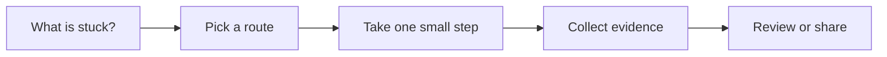

# Documentation and Knowledge

[English](README.md) | [简体中文](README.zh-CN.md)

Use this when decisions and project knowledge keep disappearing into chat.

## The situation

This scenario turns useful work context into durable knowledge. AI can summarize, draft, and reorganize, but the important human act is deciding what deserves to live beyond the conversation.

Good documentation is not a transcript. It is a maintained answer to a future question: why did we choose this, how does this work, what should someone do next, and when should they revisit the decision?

## What you should have afterward

- A decision note, runbook, guide, or reference page that future readers can find.
- A lightweight rule for when chat or PR discussion becomes documentation.
- A knowledge structure that separates stable guidance from volatile updates.

## Start here when

- Architecture or product decisions will matter again.
- New teammates lack project background.
- Docs are stale, scattered, or too expensive to update.
- A recent incident, migration, or launch produced reusable lessons.
- AI summaries are useful but currently vanish after the conversation.

## Start somewhere else when

- The content is still private research or unreviewed speculation.
- The document would duplicate a better-maintained source.
- The team wants a knowledge base but has no owner for maintenance.
- The issue is missing project setup context. Start with Project Context Memory.

## How to choose a route

A quick way to read this page:




- If it explains a choice, write a decision note or ADR.
- If it explains how to operate something, write a runbook.
- If it explains how to contribute, update README or CONTRIBUTING.
- If it explains a product or API surface, publish reference docs or examples.
- If it changes often, link to the maintained source and keep the page small.

## Common routes

### Docs-as-code

Use this when: engineering docs that should be reviewed with code and versioned.

Skip it when: cross-functional docs where non-engineers cannot comfortably contribute.

Tools that often show up: Markdown, MkDocs, Docusaurus, VitePress, GitHub Pages, pull request review.

### Team knowledge base

Use this when: cross-functional context, onboarding, support playbooks, and product decisions.

Skip it when: critical operational steps that need code review or strict change history.

Tools that often show up: Notion, Confluence, Google Docs, Slab, Linear docs.

### Architecture and decision records

Use this when: tradeoffs that people will question again.

Skip it when: writing ADRs for every small implementation choice.

Tools that often show up: ADR templates, RFCs, decision logs, Mermaid diagrams.

### AI-assisted summarization

Use this when: turning long PR threads, incident notes, and meetings into a first draft.

Skip it when: publishing summaries without checking facts, dates, owners, and open questions.

Tools that often show up: chat assistants, transcript summarizers, document assistants, internal search.

## Walk through it

1. Capture the decision or lesson close to the work.
2. Decide the document type: decision, runbook, guide, reference, or changelog.
3. Write the tradeoff behind the conclusion.
4. Put the document where future readers will look first.
5. Link related code, PRs, incidents, dashboards, or tickets.
6. Add a maintenance hint: owner, review date, or revisit condition.
7. Remove stale or duplicate material when updating.

## Example

```md
Decision:
Workspace invite actions use server-side permission checks.

Context:
The UI already hides unavailable actions, but users can still call APIs directly.

Why:
Client-side checks improve UX but cannot be the authorization boundary.

Tradeoff:
The UI may duplicate some permission logic for disabled states, but the server remains the source of authorization.

Revisit when:
Workspace permission model changes or invite ownership moves to another service.
```

## Check yourself

- Does the document answer a future question someone will actually ask?
- Is it short enough to maintain?
- Does it include tradeoffs, not only conclusions?
- Is there an owner or revisit trigger?
- Does it link to source material instead of copying everything?

## Where people get burned

- Publishing AI summaries that blur facts and assumptions.
- Creating a wiki page nobody owns.
- Writing long context docs that bury the actual decision.
- Duplicating content from a source that changes often.
- Letting chat become the only place a decision exists.

## When a team adopts it

Team practice needs a capture rule. For example: any decision that affects future code review, on-call, onboarding, or customer behavior gets a short durable note.

Use AI for first drafts and reorganization, then make a human responsible for factual accuracy, ownership, and maintenance.

## Related scenarios

- [Project Context Memory](../project-context-memory/README.md)
- [Incident Response](../incident-response/README.md)
- [Release and Change Management](../release-change-management/README.md)
