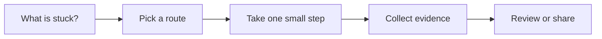

# Incident Response

[English](README.md) | [简体中文](README.zh-CN.md)

Use this when logs, alerts, dashboards, and chats need to become a shared incident picture.

## The situation

This scenario is for active or recent incidents. AI can summarize timelines, cluster logs, draft status updates, and propose hypotheses. It should not replace incident command, ownership, or direct system evidence.

During an incident, clarity beats cleverness. The team needs one shared picture: what is happening, who is affected, what changed, what has been tried, what decision is next, and who owns it.

## What you should have afterward

- A live incident timeline with facts, actions, owners, and open questions.
- A separation between mitigation, root-cause investigation, and communication.
- A post-incident note that produces follow-up tasks instead of blame.

## Start here when

- Alerts, logs, customer reports, and chats are arriving at the same time.
- Several people are investigating and context is fragmenting.
- You need status updates, timelines, or handoff notes.
- A mitigation is needed before full root cause is known.
- An incident should produce durable follow-up work.

## Start somewhere else when

- The issue is a local bug with no active customer impact. Start with Debugging.
- The expected behavior is unclear. Start with Requirements to Tasks.
- Sensitive customer data would need to be pasted into an unsafe tool.
- The team has no incident owner. Pick an incident commander before optimizing tooling.

## How to choose a route

A quick way to read this page:




- If customers are currently affected, assign incident command and mitigation owner first.
- If evidence is scattered, create a timeline before debating root cause.
- If the blast radius is unclear, identify affected users, regions, services, and time window.
- If communication is needed, draft status updates from confirmed facts only.
- If the incident is resolved, turn lessons into follow-up tasks, tests, runbooks, or alerts.

## Common routes

### Incident command and coordination

Use this when: active incidents with multiple responders or customer impact.

Skip it when: letting every responder chase their own theory without ownership.

Tools that often show up: PagerDuty, Opsgenie, Slack/Teams incident channels, Zoom/Meet bridges, incident roles.

### Observability triage

Use this when: alerts, errors, latency, traffic drops, queue growth, and partial outages.

Skip it when: jumping from a graph spike to root cause without checking deployments and logs.

Tools that often show up: Datadog, Grafana, New Relic, Sentry, OpenTelemetry, cloud provider logs.

### Customer and stakeholder communication

Use this when: user-facing outages, degraded performance, data concerns, or support volume spikes.

Skip it when: overexplaining unconfirmed causes in public updates.

Tools that often show up: Statuspage, incident comms templates, support macros, customer success notes.

### Post-incident learning

Use this when: after mitigation, when the team needs follow-up tasks and prevention work.

Skip it when: turning the postmortem into blame or a long essay nobody acts on.

Tools that often show up: postmortem templates, action item trackers, runbooks, test and alert backlogs.

## Walk through it

1. Name incident commander, technical lead, scribe, and communication owner if needed.
2. Create a timeline with timestamps, facts, actions, and links to evidence.
3. State current impact and confidence level.
4. Separate mitigation options from root-cause hypotheses.
5. Update stakeholders from confirmed facts, not speculation.
6. After mitigation, write root cause and contributing factors with evidence.
7. Turn prevention into tracked work: tests, alerts, runbooks, dashboards, cleanup, or product changes.

## Example

```md
Incident timeline:

09:12 Alert: checkout 500 rate above 5 percent.
09:14 Support reports EU checkout failures.
09:18 Release 2026.07.05 identified as recent change.
09:22 Mitigation: disable checkout_coupon_v2 for EU traffic.
09:27 500 rate returns to baseline.

Current impact:
EU checkout with coupon only. No evidence of payment capture errors.

Open questions:
- Why did coupon recalculation drop currency_code?
- Did any users retry successfully?

Follow-up:
- Add regression test for coupon plus non-default currency.
- Add dashboard panel for checkout errors by currency.
```

## Check yourself

- Is there a single incident owner?
- Does the timeline distinguish facts from hypotheses?
- Is customer impact stated with confidence level?
- Are mitigation and root-cause work separated?
- Did the incident produce tracked follow-up tasks?

## Where people get burned

- AI summarizes a thread and accidentally treats guesses as facts.
- Everyone debugs while nobody owns coordination or communication.
- The team debates root cause while mitigation is available.
- Status updates include unconfirmed technical theories.
- Postmortem action items are vague and never tracked.

## When a team adopts it

Team practice should define incident roles and a timeline format before an incident happens. AI can help the scribe summarize, but the incident commander owns decisions.

Use post-incident follow-up to strengthen other scenarios: better verification, better release checks, better docs, and better alerts.

## Related scenarios

- [Debugging](../debugging/README.md)
- [Release and Change Management](../release-change-management/README.md)
- [Documentation and Knowledge](../documentation-knowledge/README.md)
