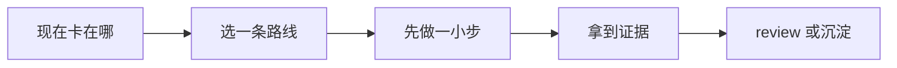

# 事故响应

[English](README.md) | 简体中文

当日志、告警、dashboard 和聊天记录需要整理成共享事故图景，就看这个场景。

## 你现在遇到的其实是什么

这个场景用于正在发生或刚结束的事故。AI 可以总结时间线、聚类日志、起草 status update、提出假设。但它不能替代 incident command、ownership 或直接系统证据。

事故里，清楚比聪明更重要。团队需要一张共享图景：发生了什么、谁受影响、最近改了什么、已经试过什么、下一步决策是什么、谁负责。

## 做完以后应该留下什么

- 一条 live incident timeline，包含事实、行动、owner 和开放问题。
- 把 mitigation、root-cause investigation 和 communication 分开。
- 一份能产生后续任务的事故复盘，而不是甩锅文章。

## 什么时候从这里开始

- 告警、日志、客户反馈和聊天同时涌进来。
- 多人一起排查，上下文开始碎片化。
- 你需要 status update、timeline 或 handoff notes。
- 还不知道完整根因，但需要先止血。
- 事故应该沉淀成可跟踪的后续工作。

## 什么时候先别看这一页

- 只是本地 bug，没有活跃客户影响。先看调试。
- 预期行为不清楚。先看需求到任务。
- 需要把敏感客户数据贴进不安全工具。
- 团队还没有 incident owner。先指定 incident commander，再谈工具优化。

## 怎么选路线

可以先按这条线读：




- 如果客户正在受影响，先指定 incident command 和 mitigation owner。
- 如果证据分散，先建 timeline，再争论 root cause。
- 如果 blast radius 不清楚，先确认受影响用户、区域、服务和时间窗。
- 如果需要沟通，只用已确认事实起草 status update。
- 如果事故已恢复，把经验转成后续任务、测试、runbook 或 alert。

## 常见路线

### Incident command 和协调

适合: 有多个 responder 或客户影响的活跃事故。

不适合: 每个人都追自己的理论，但没人负责整体决策。

常见工具和做法: PagerDuty、Opsgenie、Slack/Teams incident channels、Zoom/Meet bridges、incident roles。

### Observability triage

适合: alerts、errors、latency、traffic drops、queue growth 和局部故障。

不适合: 看到图上 spike 就直接认定 root cause，不查 deploy 和 logs。

常见工具和做法: Datadog、Grafana、New Relic、Sentry、OpenTelemetry、cloud provider logs。

### 客户和 stakeholder 沟通

适合: 用户可见故障、性能下降、数据疑虑或 support volume 激增。

不适合: 在公开更新里解释未经确认的原因。

常见工具和做法: Statuspage、incident comms templates、support macros、customer success notes。

### 事故后学习

适合: 止血后，团队需要后续任务和预防工作。

不适合: 把 postmortem 写成甩锅或没人行动的长文。

常见工具和做法: postmortem templates、action item trackers、runbooks、test and alert backlogs。

## 跟着做一遍

1. 需要时先指定 incident commander、technical lead、scribe 和 communication owner。
2. 建立 timeline，写时间戳、事实、行动和证据链接。
3. 写当前影响和信心等级。
4. 把 mitigation options 和 root-cause hypotheses 分开。
5. 只用已确认事实更新 stakeholders，不写猜测。
6. 止血后，用证据写 root cause 和 contributing factors。
7. 把预防动作变成 tracked work：测试、alerts、runbooks、dashboards、cleanup 或产品改动。

## 示例

```md
事故时间线:

09:12 Alert: checkout 500 rate 超过 5%。
09:14 Support 报告 EU checkout failures。
09:18 发现最近发布是 2026.07.05。
09:22 Mitigation: 对 EU traffic 关闭 checkout_coupon_v2。
09:27 500 rate 回到 baseline。

当前影响:
只影响 EU checkout + coupon。没有证据显示 payment capture 错误。

开放问题:
- 为什么 coupon recalculation 丢了 currency_code？
- 受影响用户是否 retry 成功？

后续:
- 补 coupon + 非默认币种回归测试。
- 给 dashboard 加 checkout errors by currency。
```

## 检查一下自己

- 是否有单一 incident owner？
- timeline 是否把事实和假设分开？
- 客户影响是否带信心等级？
- mitigation 和 root-cause work 是否分开？
- 事故是否产生了可跟踪后续任务？

## 最容易踩的坑

- AI 总结线程时，把猜测当成事实。
- 所有人都在 debug，但没人负责协调和沟通。
- 明明有 mitigation，团队还在争论 root cause。
- status update 写了未经确认的技术猜测。
- postmortem action items 很虚，后面也没人跟。

## 变成团队习惯以后

团队应该在事故前定义 incident roles 和 timeline 格式。AI 可以帮 scribe 总结，但决策属于 incident commander。

用事故后 follow-up 强化其他场景：更好的验证、更好的发布检查、更好的文档和更好的 alerts。

## 相关场景

- [调试](../debugging/README.zh-CN.md)
- [发布与变更管理](../release-change-management/README.zh-CN.md)
- [文档与知识](../documentation-knowledge/README.zh-CN.md)
