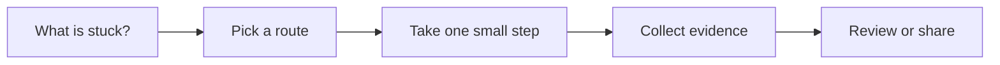

# Project Context Memory

[English](README.md) | [简体中文](README.zh-CN.md)

Use this when AI keeps missing how your project works.

## The situation

This scenario creates durable project context for humans and AI assistants. The goal is not to document the whole repo. The goal is to capture the few facts that repeatedly decide whether work goes well: setup, commands, architecture boundaries, conventions, risky areas, and review expectations.

Good context memory reduces repeated explanation. It also prevents a common AI failure: the assistant reads files but misses the local rule that matters most.

## What you should have afterward

- A short project guide that explains how to work in the repo.
- A codebase map that tells readers where to look first.
- A process for promoting repeated lessons into durable docs.

## Start here when

- Every new session needs the same setup explanation.
- AI misses local style, architecture, or review expectations.
- Project knowledge is scattered across chats, tickets, docs, and people.
- New contributors need a quicker way to understand the repo.
- You are introducing coding agents and want them to stop making the same first-day mistakes.

## Start somewhere else when

- The knowledge is still speculative research. Keep it in personal notes until it stabilizes.
- The team has no shared agreement yet. Capture the disagreement instead of pretending it is a rule.
- The information is secret, credential-like, or personal local setup. Keep it out of public docs.
- The task itself is unclear. Start with Requirements to Tasks.

## How to choose a route

A quick way to read this page:




- If the fact affects most tasks, put it in the repo guide or contributor guide.
- If the fact affects one subsystem, put it near that subsystem or link from the subsystem README.
- If the fact explains a decision, write an ADR or decision note.
- If the fact is personal, temporary, or sensitive, keep it in local ignored notes.
- If the fact changes every week, link to the source of truth instead of copying it.

## Common routes

### Repo guide

Use this when: setup commands, test commands, project layout, coding conventions, and review expectations.

Skip it when: turning it into a full architecture book that nobody reads.

Tools that often show up: README, CONTRIBUTING, docs folder, team-approved assistant instructions.

### Codebase map

Use this when: large repos, monorepos, unfamiliar legacy systems, or onboarding.

Skip it when: listing every file. A map should show where decisions happen.

Tools that often show up: directory notes, Mermaid diagrams, architecture overview pages, dependency graphs.

### Decision memory

Use this when: architecture, security, data, and product tradeoffs that people will ask about again.

Skip it when: rewriting history to make decisions look cleaner than they were.

Tools that often show up: ADR, RFC archive, decision log, docs-as-code.

### Assistant context layer

Use this when: teams using coding agents or IDE assistants repeatedly in the same repo.

Skip it when: committing personal prompts, private credentials, or sensitive local agent configuration.

Tools that often show up: project instructions, IDE rule files, workspace memory, ignored local notes.

## Walk through it

1. List the last five things you had to explain to an assistant or new teammate.
2. Separate stable context from task-specific context.
3. Write the stable context in the shortest public place future readers will check.
4. Add a repo map with important directories and where not to make casual changes.
5. Link deeper docs instead of copying them.
6. Add a small review rule: if the same mistake happens twice, update the context.
7. Keep local, personal, or sensitive agent notes ignored by git.

## Example

```md
Local commands:
- Install: pnpm install
- Test: pnpm test
- Typecheck: pnpm typecheck

Project map:
- app/: product screens and route-level state
- api/: server routes and request validation
- db/: schema and migrations

Conventions:
- Keep UI state in page-level hooks.
- Add tests for permission changes.
- Prefer existing service helpers over new fetch wrappers.

Careful:
- Billing and workspace membership need extra review.
- Do not commit personal agent notes or local credentials.
```

## Check yourself

- Can a new session run and test the project without asking basic setup questions?
- Does the guide say which directories are important and why?
- Does it name risky areas such as auth, billing, data migrations, and notifications?
- Does it link to deeper docs instead of duplicating them?
- Are personal agent notes and local secrets ignored by git?

## Where people get burned

- The guide becomes a dumping ground for every opinion.
- The doc explains commands but not the project shape.
- Sensitive local instructions are committed to the public repo.
- The team writes context once and never updates it after repeated mistakes.
- AI is asked to infer architecture from file names alone.

## When a team adopts it

Team practice starts with ownership. Decide who can change the project guide and when. Treat it like code: small changes, review when the guidance affects many people, and remove stale rules.

For AI-assisted teams, separate public project guidance from private local agent configuration. The public guide should help any contributor. Local ignored notes can hold personal workflow details.

## Related scenarios

- [Requirements to Tasks](../requirements-to-tasks/README.md)
- [Documentation and Knowledge](../documentation-knowledge/README.md)
- [Team AI Governance](../team-ai-governance/README.md)
