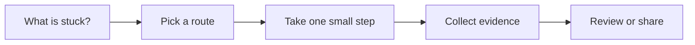

# Release and Change Management

[English](README.md) | [简体中文](README.zh-CN.md)

Use this when a change needs release notes, rollout steps, migration notes, or rollback thinking.

## The situation

This scenario covers the path from merged change to safe adoption. AI can draft release notes, summarize diffs, build rollout checklists, and compare migration steps. Humans still need to own risk, timing, customer communication, and rollback decisions.

The question is not only what changed. It is who is affected, how the change reaches them, how you will know it is healthy, and what you will do if it is not.

## What you should have afterward

- Release notes that match the actual change and the audience.
- A rollout plan with owners, checks, and rollback conditions.
- Migration or operational notes for teams who need to act.

## Start here when

- A change affects users, operators, support, customers, or downstream teams.
- There is a migration, feature flag, config change, or dependency upgrade.
- A release needs monitoring, staged rollout, or rollback planning.
- AI-generated code is shipping and you need a sharper release review.
- Support, sales, or customer success need a plain-language summary.

## Start somewhere else when

- The change is not understood or verified. Start with Code Review or Automated Verification.
- The system is already failing. Start with Incident Response.
- The change is internal and low risk, and a PR summary is enough.
- The team cannot monitor the behavior after release. Build observability first.

## How to choose a route

A quick way to read this page:




- If the change is user-visible, write release notes in user language.
- If the change is operational, write rollout and rollback steps.
- If the change is risky, use a feature flag, canary, staged rollout, or migration gate.
- If customers must act, write migration notes and support guidance.
- If the release changes AI behavior, include eval results and monitoring signals.

## Common routes

### Release notes and changelog

Use this when: user-visible features, fixes, breaking changes, and customer communication.

Skip it when: copying commit messages that explain implementation instead of user impact.

Tools that often show up: Keep a Changelog format, Changesets, Release Please, semantic-release, GitHub Releases.

### Feature flag and progressive rollout

Use this when: risky behavior changes, partial rollout, experiments, and fast rollback.

Skip it when: keeping flags forever without cleanup ownership.

Tools that often show up: LaunchDarkly, Statsig, Unleash, Flipt, homegrown flag systems.

### Migration planning

Use this when: database changes, API versioning, dependency upgrades, data backfills, and customer action.

Skip it when: one-way migrations without backups, dry runs, or rollback thinking.

Tools that often show up: migration frameworks, backfill jobs, OpenAPI versioning, runbooks, maintenance windows.

### Release observability

Use this when: changes that could affect latency, errors, revenue, support volume, or AI output quality.

Skip it when: shipping first and deciding metrics later.

Tools that often show up: Sentry, Datadog, New Relic, Grafana, OpenTelemetry, product analytics, eval dashboards.

## Walk through it

1. Summarize what changed in audience language: user, operator, developer, or customer.
2. Identify affected surfaces: UI, API, data, permissions, billing, integrations, docs, support.
3. Choose rollout shape: all at once, staged, feature flag, canary, beta, migration window.
4. Define health checks and rollback conditions before release.
5. Write migration or support notes if anyone outside engineering must act.
6. Attach verification evidence from tests, CI, manual checks, or evals.
7. After release, record what happened and clean up temporary flags or notes.

## Example

```md
Release:
Workspace member invite flow now supports duplicate-invite handling.

Audience note:
Admins see a clear error when trying to invite someone who already has a pending invite.

Rollout:
Enable for 10 percent of workspaces for 24 hours, then 100 percent if healthy.

Health checks:
- Invite API 4xx/5xx rate.
- Support tickets mentioning invite errors.
- Pending invite creation count.

Rollback:
Disable invite_duplicate_error_v2 flag if 5xx rate doubles or support tickets spike.

Support note:
Ask admins to cancel the pending invite before sending a new one.
```

## Check yourself

- Does the release note explain impact instead of implementation only?
- Are affected audiences and surfaces named?
- Are rollout, owner, and timing clear?
- Are health checks and rollback conditions defined before release?
- Will temporary flags, migration code, or docs be cleaned up later?

## Where people get burned

- AI drafts release notes from commit messages and misses user impact.
- A risky change ships without a flag, canary, or rollback path.
- Migration notes omit who must run what and when.
- Monitoring is added after the release goes wrong.
- Feature flags become permanent complexity.

## When a team adopts it

Team practice should connect PR evidence to release evidence. A reviewer should be able to see what was verified before merge and what will be watched after release.

For repeated releases, keep a release checklist that AI can help fill in, but require humans to approve risk, rollout, and rollback decisions.

## Related scenarios

- [Automated Verification](../automated-verification/README.md)
- [Incident Response](../incident-response/README.md)
- [Documentation and Knowledge](../documentation-knowledge/README.md)
