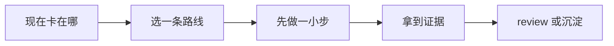

# 发布与变更管理

[English](README.md) | 简体中文

当一个改动需要 release notes、灰度步骤、迁移说明或回滚思考，就看这个场景。

## 你现在遇到的其实是什么

这个场景覆盖从 merge 到安全采用之间的路。AI 可以草拟 release notes、总结 diff、生成 rollout checklist、对照 migration steps。但风险、时机、客户沟通和回滚决策仍然要由人负责。

问题不只是“改了什么”。还要问：谁会受影响？改动怎么到达他们？你怎么知道它健康？如果不健康，你准备怎么退？

## 做完以后应该留下什么

- 和真实改动、真实读者匹配的 release notes。
- 有 owner、检查项和回滚条件的 rollout plan。
- 给需要行动的人看的 migration 或 operational notes。

## 什么时候从这里开始

- 改动影响用户、运维、support、客户或下游团队。
- 有 migration、feature flag、配置变化或依赖升级。
- 发布需要监控、灰度或回滚计划。
- AI 生成的代码要上线，你需要更清楚的 release review。
- Support、sales 或 customer success 需要人话总结。

## 什么时候先别看这一页

- 改动还没理解或验证。先看代码审查或自动化验证。
- 系统已经在故障中。先看事故响应。
- 改动是低风险内部变化，PR summary 已经足够。
- 发布后没法监控行为。先补 observability。

## 怎么选路线

可以先按这条线读：




- 如果用户可见，用用户语言写 release notes。
- 如果是运维变化，写 rollout 和 rollback steps。
- 如果风险高，用 feature flag、canary、staged rollout 或 migration gate。
- 如果客户需要行动，写 migration notes 和 support guidance。
- 如果发布改变 AI 行为，附 eval 结果和 monitoring signals。

## 常见路线

### Release notes 和 changelog

适合: 用户可见功能、修复、breaking changes 和客户沟通。

不适合: 照抄 commit message，只讲实现，不讲影响。

常见工具和做法: Keep a Changelog、Changesets、Release Please、semantic-release、GitHub Releases。

### Feature flag 和 progressive rollout

适合: 高风险行为变化、局部发布、实验和快速回滚。

不适合: flag 永久存在，却没人负责清理。

常见工具和做法: LaunchDarkly、Statsig、Unleash、Flipt、自建 flag 系统。

### Migration planning

适合: 数据库变化、API versioning、依赖升级、data backfill 和客户动作。

不适合: 没有 backup、dry run 或 rollback 思考的单向迁移。

常见工具和做法: migration frameworks、backfill jobs、OpenAPI versioning、runbooks、maintenance windows。

### Release observability

适合: 可能影响 latency、errors、revenue、support volume 或 AI output quality 的变化。

不适合: 先上线，出问题后才决定看什么指标。

常见工具和做法: Sentry、Datadog、New Relic、Grafana、OpenTelemetry、product analytics、eval dashboards。

## 跟着做一遍

1. 用读者语言总结变化：用户、运维、开发者或客户。
2. 列出受影响 surface：UI、API、data、permissions、billing、integrations、docs、support。
3. 选择发布形态：全量、分阶段、feature flag、canary、beta、migration window。
4. 发布前定义 health checks 和 rollback conditions。
5. 如果工程外的人需要行动，写 migration 或 support notes。
6. 附上测试、CI、手动检查或 eval 的验证证据。
7. 发布后记录发生了什么，并清理临时 flags 或 notes。

## 示例

```md
发布:
Workspace member invite flow 支持重复邀请处理。

读者说明:
管理员邀请已有 pending invite 的成员时，会看到清楚错误。

Rollout:
先给 10% workspaces 开 24 小时；健康后全量。

Health checks:
- Invite API 4xx/5xx rate。
- 提到 invite errors 的 support tickets。
- 待处理邀请创建数。

Rollback:
如果 5xx rate 翻倍或 support tickets 激增，关闭 invite_duplicate_error_v2 flag。

Support note:
让管理员先 cancel pending invite，再发送新邀请。
```

## 检查一下自己

- release note 是否讲影响，而不只是实现？
- 受影响读者和 surface 是否写清？
- rollout、owner 和 timing 是否明确？
- health checks 和 rollback conditions 是否在发布前定义？
- 临时 flags、migration code 或 docs 后面会不会清理？

## 最容易踩的坑

- AI 从 commit message 草拟 release notes，漏掉用户影响。
- 高风险变化没有 flag、canary 或 rollback path 就发布。
- migration notes 没写谁在什么时候跑什么。
- 出问题后才开始补 monitoring。
- feature flags 变成永久复杂度。

## 变成团队习惯以后

团队实践应该把 PR evidence 和 release evidence 连起来。reviewer 应该能看到 merge 前验证了什么，发布后要观察什么。

重复发布时，保留一份 release checklist。AI 可以帮填，但风险、rollout 和 rollback 决策必须由人批准。

## 相关场景

- [自动化验证](../automated-verification/README.zh-CN.md)
- [事故响应](../incident-response/README.zh-CN.md)
- [文档与知识](../documentation-knowledge/README.zh-CN.md)
