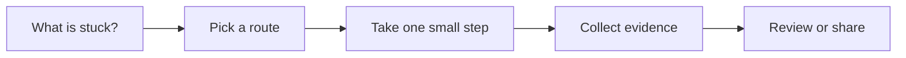

# Requirements to Tasks

[English](README.md) | [简体中文](README.zh-CN.md)

Use this when a request is real, but still too vague for an engineer or AI assistant to start safely.

## The situation

This scenario turns loose intent into a piece of work that can be implemented, reviewed, and verified. It sits between product conversation and code. The output is not a full PRD unless the work needs one. The output is a task brief that removes the most dangerous ambiguity before implementation starts.

The central question is simple: what does the user or system need to do differently, and how will we know the change is done? AI can help draft, split, and test a task, but it should not invent product decisions, permission rules, rollout constraints, or acceptance criteria without review.

## What you should have afterward

- A task brief with intent, non-goals, acceptance checks, constraints, and verification.
- A shared definition of done before code starts.
- A smaller implementation surface for a human engineer or coding agent.

## Start here when

- A request can be interpreted in several ways.
- Several people need to agree on what done means.
- The work may touch product behavior, design, data, permissions, pricing, or rollout.
- You want an AI assistant to implement without guessing missing context.
- A larger PRD, design, or customer request needs to become engineering tasks.

## Start somewhere else when

- The problem is still discovery work and nobody knows whether the feature should exist.
- The user journey or design is still changing every hour.
- The task is pure production incident response. Start with Incident Response instead.
- The code is already changed and the question is whether it works. Start with Automated Verification or Code Review.

## How to choose a route

A quick way to read this page:




- If the request is one sentence and low risk, write a short task brief in the issue or PR description.
- If behavior touches multiple roles, data states, or permissions, add acceptance examples before implementation.
- If the work spans several teams, use a PRD, design doc, or RFC first, then split into tasks.
- If the work is old-system cleanup, add impact notes and rollback assumptions before asking AI to edit code.
- If the assistant keeps asking project questions, pair this with Project Context Memory.

## Common routes

### Lightweight issue brief

Use this when: small product changes, UI fixes, one endpoint, or a bug with known expected behavior.

Skip it when: cross-team work, unclear product decisions, or changes with compliance, billing, or migration risk.

Tools that often show up: GitHub Issues, Linear, Jira, plain Markdown, issue templates.

### PRD or RFC to task split

Use this when: the product direction exists, but engineers need scoped slices and sequencing.

Skip it when: using a PRD as a substitute for unresolved product decisions.

Tools that often show up: Notion, Confluence, Google Docs, Linear projects, Jira epics, GitHub milestones.

### Acceptance example or BDD style

Use this when: behavior depends on roles, states, edge cases, or user-visible messages.

Skip it when: turning every tiny task into ceremony. A few examples are often enough.

Tools that often show up: Gherkin-style examples, Given/When/Then notes, test case tables, Storybook stories for UI states.

### AI-assisted task shaping

Use this when: you already know the intent and want help finding gaps, splitting work, or drafting checks.

Skip it when: letting the assistant decide scope, pricing, permissions, or rollout policy without a human decision.

Tools that often show up: chat assistants, IDE assistants, coding agents, internal planning templates.

## Walk through it

1. Write the user-facing or system-facing change in one sentence.
2. Name the actor, starting state, action, and expected result.
3. List non-goals before implementation starts. This is where scope control happens.
4. Add acceptance checks in observable language. Prefer examples over abstract requirements.
5. Add implementation clues: likely files, APIs, commands, data models, feature flags, and risk areas.
6. Choose verification: unit test, integration test, E2E smoke test, manual check, or CI gate.
7. Ask AI to restate the task and identify missing assumptions before it edits code.

## Example

```md
Intent:
Workspace admins can invite one teammate by email from workspace settings.

Non-goals:
- No bulk invites.
- No role management changes.
- No billing changes.

Acceptance:
- Admin can submit one valid email.
- A pending invite appears in the members list.
- Duplicate invite shows a clear error.
- Non-admin users cannot access the invite action.

Implementation clues:
- Settings members page.
- Invite API route.
- Workspace membership permissions.

Verification:
- Run member permission tests.
- Smoke test the browser flow for success and duplicate invite.
```

## Check yourself

- Can a new engineer explain the task after reading it once?
- Are non-goals explicit enough to prevent scope creep?
- Are acceptance checks observable in the UI, API, database, or logs?
- Is there at least one verification path before merge?
- Are product, design, security, and rollout assumptions named instead of implied?

## Where people get burned

- The task says improve or support without naming the behavior that changes.
- Acceptance criteria describe implementation details but not user-visible outcomes.
- The assistant receives a vague task and fills gaps with plausible but wrong product choices.
- The task hides risky work such as permissions, billing, migration, or notification behavior.
- The team writes a long spec but never turns it into reviewable slices.

## When a team adopts it

Teams should standardize the smallest useful task shape, not the largest possible spec. A useful template has intent, non-goals, acceptance checks, constraints, and verification. Larger documents can exist, but every implementation slice still needs a clear task brief.

For AI-assisted work, ask contributors to include the original task brief in the PR. Reviewers can then judge whether the diff matches the task instead of reviewing a loose pile of generated code.

## Related scenarios

- [Project Context Memory](../project-context-memory/README.md)
- [Automated Verification](../automated-verification/README.md)
- [Code Review and Quality Gates](../code-review-quality-gates/README.md)
