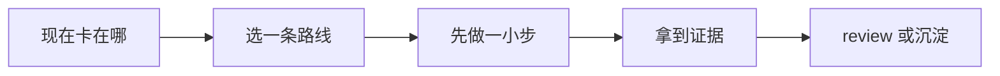

# 团队 AI 治理

[English](README.md) | 简体中文

当团队已经在用 AI 工具，并且需要统一边界，就看这个场景。

## 你现在遇到的其实是什么

这个场景帮团队定义实用的 AI 使用边界，不把治理变成表演。风险不只是“用了 AI”，而是工具拿到了 repos、tickets、terminals、browsers、logs 和 customer data，却没有共同预期。

好的治理让团队更快，同时 ownership 更清楚。它会说清工具能访问什么、哪些动作必须人工批准、AI-assisted work 需要什么证据，以及团队怎么从错误里学习。

## 做完以后应该留下什么

- 一份短团队 AI 使用指南，覆盖数据、工具、写权限和 review 规则。
- 一条高风险工具和 workflow 的轻量批准路径。
- AI-assisted work 在 PR 和事故中的共同标准。

## 什么时候从这里开始

- 大家用不同 AI 工具，而且用法不一致。
- AI 工具可以访问 repos、tickets、terminals、browsers、logs 或敏感数据。
- reviewer 不确定 AI-assisted work 应该带什么证据。
- 团队想提速，但不想引入不必要风险。
- 客户、安全、法务或合规问题已经冒出来。

## 什么时候先别看这一页

- 团队还没有真实 AI workflow。先做小 pilot，不要先写大政策。
- 团队还没理解真实用法，就想写一份很重的 policy。
- 问题只是一个任务或 PR 不清楚。用对应场景解决。
- 政策无法执行，也无法审计。

## 怎么选路线

可以先按这条线读：




- 如果工具只读公开数据，规则可以轻。
- 如果工具读取私有代码或 tickets，定义数据边界和账号 ownership。
- 如果工具能改代码、跑命令、建 PR 或调用外部系统，要求 review 和 approval rules。
- 如果工具接触 customer data，应用 data classification、redaction、vendor review 和 audit expectations。
- 如果 AI output 影响生产或客户，要求证据和人工 ownership。

## 常见路线

### 使用政策和数据分级

适合: 处理私有代码、客户数据、受监管数据或 vendor tools 的团队。

不适合: 写一份没人记得住、真实工作里用不上的 policy。

常见工具和做法: 团队 policy docs、data classification tables、vendor review checklists、security questionnaires。

### 工具访问和权限

适合: coding agents、browser agents、repo integrations、ticket integrations 和 terminal access。

不适合: 因为配置方便就给宽泛写权限。

常见工具和做法: SSO、role-based access、GitHub permissions、sandboxing、audit logs、branch protection。

### AI-assisted work 标准

适合: AI 参与的 PR、事故记录、文档、测试和生成代码。

不适合: 要求披露每次 autocomplete，却忽略高风险 agentic edits。

常见工具和做法: PR templates、review checklists、evidence requirements、CODEOWNERS。

### 学习闭环

适合: 希望治理跟着真实使用变好，而不是停在静态 policy 的团队。

不适合: 把治理当成一次性文档。

常见工具和做法: retros、incident reviews、tool audits、prompt and workflow libraries、enablement sessions。

## 跟着做一遍

1. 盘点当前 AI tools、users、data access、write access 和 external integrations。
2. 给数据分级：public、internal、confidential、customer、regulated、secrets。
3. 分别定义读边界和写边界。
4. 给 code changes、external writes、production settings 和 customer data 设置人工批准规则。
5. 定义 AI-assisted work 的 PR evidence：task intent、verification、known limits 和 reviewer ownership。
6. 本地个人 agent notes 和 secrets 不要提交到公开文件。
7. 根据真实事故、near misses 或 workflow 变化回看规则。

## 示例

```md
团队 AI 使用指南:

AI 可以:
- 读取公开文档和批准过的 repository code。
- 草拟 task briefs、tests、documentation 和 PR summaries。
- 在 branch 上建议 code changes。

AI 需要人工批准后才能:
- Push 代码。
- 运行会影响外部系统的命令。
- 修改 production settings。
- 使用 customer data 或 private logs。

每个 AI-assisted PR 应该带上:
- 任务意图。
- 验证证据。
- 已知限制。
- 对最终 diff 负责的人。
```

## 检查一下自己

- 大家是否知道哪些数据能进 AI 工具，哪些不能？
- 读权限和写权限是否分开处理？
- 高风险动作是否需要人工批准？
- AI-assisted PR 是否包含证据和 ownership？
- 团队能否根据事故或 near miss 更新规则？

## 最容易踩的坑

- policy 抽象地禁止或允许 AI，但不匹配真实 workflow。
- 个人 agent instructions 或 secrets 被提交到公开 repo。
- AI 工具拿到宽泛 repo 或生产权限，却没有 auditability。
- reviewer 看不出 PR 哪些部分是生成的、哪些被验证过。
- 治理挡住低风险工作，却漏掉高风险数据暴露。

## 变成团队习惯以后

团队实践应该从小处开始：记录真实工具和 workflow，再围绕数据和写权限设边界。只有真实使用需要时，再扩大治理范围。

治理要和其他场景连起来。需求定义 AI 应该做什么，验证证明它做成了，review 保护 merge，release management 控制生产暴露。

## 相关场景

- [项目上下文记忆](../project-context-memory/README.zh-CN.md)
- [代码审查与质量门禁](../code-review-quality-gates/README.zh-CN.md)
- [发布与变更管理](../release-change-management/README.zh-CN.md)
